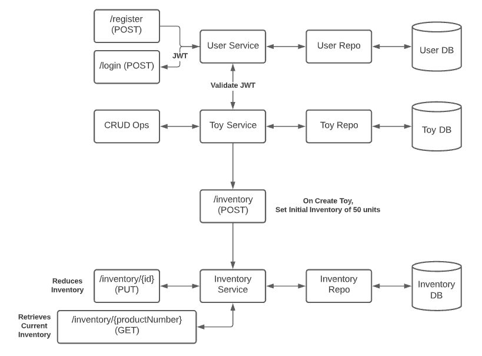

# Lab 03 - Deploy Users Microservice

In this hack-a-thon, you will use Docker images provided for you to create a set of microservices that enable management of a toyshop's inventory.

## Register new user

POST against http://localhost:5050/register using a request body like this:

{
    "id": 0,
    "name": "Melissa Testing",
    "email": "mtesting@test.com",
    "password": "password123"
}

## Login existing user and get new JWT

POST against http://localhost:5050/login using a request body like this:

{
    "email": "mtesting@test.com",
    "password": "password123"
}

## Deploy to Kubernetes

Using `gamuttechsvcsllc/users-svc:1.0` and the `mysql` image, create manifests to deploy the users microservice to k8s along with a database. Use Services to enable access to the defined API routes and access to the MySQL database from the services. Use ConfigMaps and Secrets where appropriate for storage and provision of configuration detail. Also, leverage PersistentVolumeClaims where relevant to maintain required data across any Pod replacements.

For `users` service, config currently looks like this:

MYSQL_DATABASE = users_db  
MYSQL_PASSWORD = pass
MYSQL_USERNAME = root
MYSQL_SERVICE_HOST = localhost
